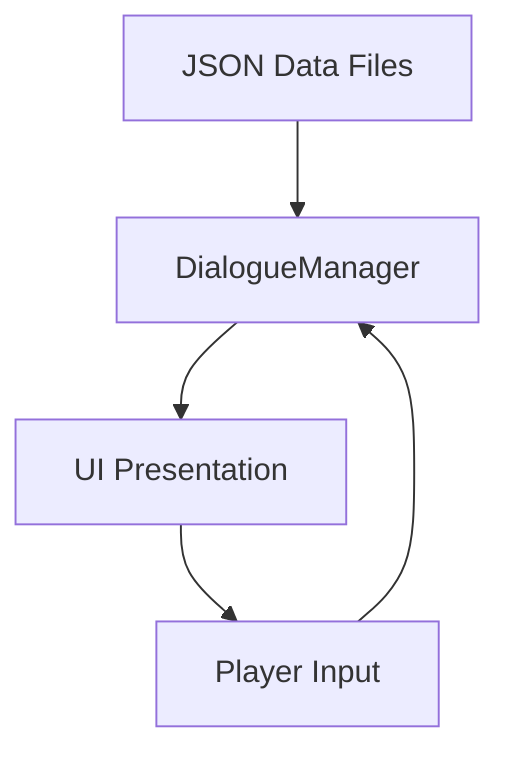

# Visual Novel Dialogue System - Technical Specification

## 1. System Overview

The visual novel dialogue system is designed with a modular architecture to ensure separation of concerns and maintainability. The system consists of several key components that work together to provide a complete dialogue experience:

### 1.1 Data Component
- **Purpose**: Stores all dialogue content in structured JSON format
- **Responsibility**: Define dialogue nodes, character information, and story flow
- **Format**: JSON files in Unity's StreamingAssets folder for easy editing by writers

### 1.2 Logic Component
- **Purpose**: Processes dialogue data and manages conversation flow
- **Responsibility**: Load JSON files, track conversation state, handle player choices, execute end actions
- **Implementation**: C# scripts that interface with Unity's engine systems

### 1.3 Presentation Component
- **Purpose**: Renders dialogue to the screen with visual effects
- **Responsibility**: Display text with typewriter effect, show character portraits, present choice buttons
- **Implementation**: Unity UI system with animations and transitions

### 1.4 Component Interaction Flow



## 2. Data Structure Specification

### 2.1 Dialogue Node Structure

Dialogue nodes are the fundamental building blocks of conversations. Each node represents a single piece of dialogue or a choice point.

#### Regular Dialogue Node
```json
{
  "nodeId": "opening_001",
  "speaker": "Narrator",
  "text": "The sun rises over the bustling town of Millbrook...",
  "portrait": "",
  "background": "town_square_dawn",
  "nextNode": "opening_002",
  "choices": [],
  "actions": []
}
```

#### Choice Node
```json
{
  "nodeId": "choice_001",
  "speaker": "Narrator",
  "text": "How do you respond to the Mayor?",
  "portrait": "",
  "background": "town_square_dawn",
  "nextNode": "",
  "choices": [
    {
      "text": "I'm looking for adventure!",
      "nextNode": "adventure_path"
    },
    {
      "text": "I'm seeking work opportunities.",
      "nextNode": "work_path"
    },
    {
      "text": "Just passing through, thanks.",
      "nextNode": "passing_path"
    }
  ],
  "actions": []
}
```

#### Action Node
```json
{
  "nodeId": "ending_adventure",
  "speaker": "Narrator",
  "text": "Your adventure in Millbrook begins with investigating the mysterious forest...",
  "portrait": "",
  "background": "forest_entrance",
  "nextNode": "",
  "choices": [],
  "actions": [
    {
      "type": "loadScene",
      "value": "ForestAdventure"
    }
  ]
}
```

### 2.2 JSON Schema Definition

```json
{
  "type": "array",
  "items": {
    "type": "object",
    "properties": {
      "nodeId": {
        "type": "string",
        "description": "Unique identifier for this dialogue node"
      },
      "speaker": {
        "type": "string",
        "description": "Name of the character speaking"
      },
      "text": {
        "type": "string",
        "description": "Dialogue text to display"
      },
      "portrait": {
        "type": "string",
        "description": "Identifier for character portrait to display"
      },
      "background": {
        "type": "string",
        "description": "Background scene identifier"
      },
      "nextNode": {
        "type": "string",
        "description": "ID of next node if no choices are present"
      },
      "choices": {
        "type": "array",
        "items": {
          "type": "object",
          "properties": {
            "text": {
              "type": "string",
              "description": "Choice text to display to player"
            },
            "nextNode": {
              "type": "string",
              "description": "Node ID to transition to when selected"
            }
          },
          "required": ["text", "nextNode"]
        }
      },
      "actions": {
        "type": "array",
        "items": {
          "type": "object",
          "properties": {
            "type": {
              "type": "string",
              "enum": ["loadScene", "unlockAchievement", "setVariable", "addItem"]
            },
            "value": {
              "type": "string",
              "description": "Parameter for the action"
            }
          },
          "required": ["type", "value"]
        }
      }
    },
    "required": ["nodeId", "speaker", "text", "portrait", "background", "nextNode", "choices", "actions"]
  }
}
```

## 3. Logic Implementation

### 3.1 DialogueManager.cs Functionality

The DialogueManager is a singleton MonoBehaviour that orchestrates the dialogue system. It handles loading JSON dialogue files, tracking conversation state, processing player choices, and executing end actions like scene loading.

```csharp
using System;
using System.Collections;
using System.Collections.Generic;
using System.IO;
using UnityEngine;
using UnityEngine.SceneManagement;

/// <summary>
/// DialogueManager is a singleton MonoBehaviour that handles the visual novel dialogue system.
/// It loads JSON dialogue files, tracks conversation state, processes player choices,
/// and executes end actions like scene loading.
/// </summary>
public class DialogueManager : MonoBehaviour
{
    // Singleton instance
    private static DialogueManager _instance;
    
    // Event for notifying the UI when a dialogue node changes
    public static event Action<DialogueNode> OnDialogueNodeChanged;
    
    // Event for notifying the UI when choices are available
    public static event Action<List<DialogueChoice>> OnChoicesAvailable;
    
    // Dictionary to store loaded dialogue nodes by their ID
    private Dictionary<string, DialogueNode> dialogueNodes;
    
    // Current dialogue state
    private string currentDialogueId;
    private DialogueNode currentNode;
    private Stack<string> dialogueHistory;
    
    // Path to the StreamingAssets folder
    private string streamingAssetsPath;
    
    /// <summary>
    /// Gets the singleton instance of the DialogueManager.
    /// </summary>
    public static DialogueManager Instance
    {
        get
        {
            if (_instance == null)
            {
                // Try to find an existing instance in the scene
                _instance = FindObjectOfType<DialogueManager>();
                
                // If not found, create a new GameObject with the DialogueManager component
                if (_instance == null)
                {
                    GameObject managerObject = new GameObject("DialogueManager");
                    _instance = managerObject.AddComponent<DialogueManager>();
                }
            }
            return _instance;
        }
    }
    
    /// <summary>
    /// Initializes the DialogueManager.
    /// </summary>
    void Awake()
    {
        // Ensure only one instance exists
        if (_instance == null)
        {
            _instance = this;
            DontDestroyOnLoad(gameObject);
            
            // Initialize variables
            dialogueNodes = new Dictionary<string, DialogueNode>();
            dialogueHistory = new Stack<string>();
            streamingAssetsPath = Application.streamingAssetsPath;
        }
        else if (_instance != this)
        {
            // Destroy duplicate instances
            Destroy(gameObject);
        }
    }
    
    /// <summary>
    /// Loads a dialogue from a JSON file in the StreamingAssets folder.
    /// </summary>
    /// <param name="fileName">The name of the JSON file to load.</param>
    public void LoadDialogue(string fileName)
    {
        try
        {
            string path = Path.Combine(streamingAssetsPath, fileName);
            
            if (File.Exists(path))
            {
                string jsonContent = File.ReadAllText(path);
                
                // Parse the JSON content
                DialogueNode[] nodes = JsonHelper.FromJson<DialogueNode>(jsonContent);
                
                // Clear existing nodes and populate with new ones
                dialogueNodes.Clear();
                foreach (var node in nodes)
                {
                    if (!string.IsNullOrEmpty(node.nodeId))
                    {
                        dialogueNodes[node.nodeId] = node;
                    }
                    else
                    {
                        Debug.LogWarning("Dialogue node found with empty nodeId in file: " + fileName);
                    }
                }
                
                Debug.Log("Successfully loaded dialogue file: " + fileName);
            }
            else
            {
                Debug.LogError("Dialogue file not found: " + path);
            }
        }
        catch (Exception e)
        {
            Debug.LogError("Error loading dialogue file: " + e.Message);
        }
    }
    
    /// <summary>
    /// Starts a dialogue sequence from a specific node.
    /// </summary>
    /// <param name="fileName">The JSON file containing the dialogue.</param>
    /// <param name="startNodeId">The ID of the starting dialogue node.</param>
    public void StartDialogue(string fileName, string startNodeId)
    {
        // Load the dialogue file
        LoadDialogue(fileName);
        
        // Check if the start node exists
        if (dialogueNodes.ContainsKey(startNodeId))
        {
            currentDialogueId = startNodeId;
            currentNode = dialogueNodes[startNodeId];
            dialogueHistory.Clear();
            
            // Process the current node
            ProcessCurrentNode();
        }
        else
        {
            Debug.LogError("Start node ID not found in dialogue: " + startNodeId);
        }
    }
    
    /// <summary>
    /// Advances to the next dialogue node in a linear conversation.
    /// </summary>
    public void NextNode()
    {
        // If there are choices, we shouldn't automatically advance
        if (currentNode.choices != null && currentNode.choices.Count > 0)
        {
            // Present choices to the player
            PresentChoices(currentNode.choices);
            return;
        }
        
        // If there's a next node specified, go to it
        if (!string.IsNullOrEmpty(currentNode.nextNode))
        {
            TransitionToNode(currentNode.nextNode);
        }
        else
        {
            // If no next node and no choices, end the dialogue
            EndDialogue();
        }
    }
    
    /// <summary>
    /// Selects a choice and transitions to the appropriate node.
    /// </summary>
    /// <param name="choiceIndex">The index of the selected choice.</param>
    public void SelectChoice(int choiceIndex)
    {
        if (currentNode.choices != null && choiceIndex >= 0 && choiceIndex < currentNode.choices.Count)
        {
            // Record current node in history
            dialogueHistory.Push(currentNode.nodeId);
            
            // Get the next node ID from the choice
            string nextNodeId = currentNode.choices[choiceIndex].nextNode;
            
            // Transition to the next node
            TransitionToNode(nextNodeId);
        }
        else
        {
            Debug.LogError("Invalid choice index: " + choiceIndex);
        }
    }
    
    /// <summary>
    /// Transitions to a specific dialogue node.
    /// </summary>
    /// <param name="nodeId">The ID of the node to transition to.</param>
    private void TransitionToNode(string nodeId)
    {
        if (dialogueNodes.ContainsKey(nodeId))
        {
            currentDialogueId = nodeId;
            currentNode = dialogueNodes[nodeId];
            ProcessCurrentNode();
        }
        else
        {
            Debug.LogError("Node ID not found in dialogue: " + nodeId);
            EndDialogue();
        }
    }
    
    /// <summary>
    /// Processes the current dialogue node and notifies the UI.
    /// </summary>
    private void ProcessCurrentNode()
    {
        // Notify the UI about the new node
        OnDialogueNodeChanged?.Invoke(currentNode);
        
        // Check if this node has immediate actions to execute
        if (currentNode.actions != null && currentNode.actions.Count > 0)
        {
            ExecuteActions(currentNode.actions);
        }
        
        // If the node has choices, present them to the player
        if (currentNode.choices != null && currentNode.choices.Count > 0)
        {
            PresentChoices(currentNode.choices);
        }
        // If no choices and no next node, end the dialogue
        else if (string.IsNullOrEmpty(currentNode.nextNode))
        {
            EndDialogue();
        }
    }
    
    /// <summary>
    /// Presents choices to the player through the UI.
    /// </summary>
    /// <param name="choices">The list of choices to present.</param>
    private void PresentChoices(List<DialogueChoice> choices)
    {
        OnChoicesAvailable?.Invoke(choices);
    }
    
    /// <summary>
    /// Executes a list of actions.
    /// </summary>
    /// <param name="actions">The actions to execute.</param>
    private void ExecuteActions(List<DialogueAction> actions)
    {
        foreach (var action in actions)
        {
            switch (action.type)
            {
                case "loadScene":
                    SceneManager.LoadScene(action.value);
                    break;
                case "unlockAchievement":
                    // Implementation depends on achievement system
                    Debug.Log("Unlocking achievement: " + action.value);
                    break;
                case "setVariable":
                    // Set a game variable
                    Debug.Log("Setting variable: " + action.value);
                    break;
                case "addItem":
                    // Add item to player inventory
                    Debug.Log("Adding item: " + action.value);
                    break;
                default:
                    Debug.LogWarning("Unknown action type: " + action.type);
                    break;
            }
        }
    }
    
    /// <summary>
    /// Ends the current dialogue.
    /// </summary>
    private void EndDialogue()
    {
        Debug.Log("Dialogue ended");
        currentDialogueId = null;
        currentNode = null;
        // Notify the UI that dialogue has ended
        OnDialogueNodeChanged?.Invoke(null);
    }
    
    /// <summary>
    /// Gets the current dialogue node.
    /// </summary>
    /// <returns>The current dialogue node, or null if no dialogue is active.</returns>
    public DialogueNode GetCurrentNode()
    {
        return currentNode;
    }
    
    /// <summary>
    /// Checks if a dialogue is currently active.
    /// </summary>
    /// <returns>True if a dialogue is active, false otherwise.</returns>
    public bool IsDialogueActive()
    {
        return currentNode != null;
    }
}

/// <summary>
/// Represents a dialogue node in the conversation.
/// </summary>
[Serializable]
public class DialogueNode
{
    public string nodeId;
    public string speaker;
    public string text;
    public string portrait;
    public string background;
    public string nextNode;
    public List<DialogueChoice> choices;
    public List<DialogueAction> actions;
    
    public DialogueNode()
    {
        choices = new List<DialogueChoice>();
        actions = new List<DialogueAction>();
    }
}
```

### 3.2 Data Classes

#### DialogueChoice.cs
```csharp
using UnityEngine;

[System.Serializable]
public class DialogueChoice
{
    public string text;
    public string nextNode;
}
```

#### DialogueAction.cs
```csharp
using UnityEngine;

[System.Serializable]
public class DialogueAction
{
    public string type;
    public string value;
}
```

## 4. Presentation Layer Implementation

### 4.1 Dialogue UI Components

The presentation layer consists of several UI components that work together to display dialogue, choices, and character portraits.

#### DialogueUI.cs
```csharp
using System.Collections;
using System.Collections.Generic;
using UnityEngine;
using UnityEngine.UI;
using TMPro;

public class DialogueUI : MonoBehaviour
{
    [Header("UI Elements")]
    [SerializeField] private GameObject dialoguePanel;
    [SerializeField] private TextMeshProUGUI speakerNameText;
    [SerializeField] private TextMeshProUGUI dialogueText;
    [SerializeField] private Image leftPortrait;
    [SerializeField] private Image rightPortrait;
    [SerializeField] private Transform choiceButtonContainer;
    [SerializeField] private GameObject choiceButtonPrefab;

    [Header("Typewriter Effect")]
    [SerializeField] private TypewriterEffect typewriterEffect;
    [SerializeField] private float typingSpeed = 0.05f;

    [Header("Portrait Fade Settings")]
    [SerializeField] private float portraitFadeDuration = 0.5f;

    private Dictionary<string, Sprite> portraitSprites = new Dictionary<string, Sprite>();

    private void OnEnable()
    {
        // Subscribe to dialogue events
        DialogueManager.OnDialogueNodeChanged += OnDialogueNodeChanged;
        DialogueManager.OnChoicesAvailable += OnChoicesAvailable;
    }

    private void OnDisable()
    {
        // Unsubscribe from dialogue events
        DialogueManager.OnDialogueNodeChanged -= OnDialogueNodeChanged;
        DialogueManager.OnChoicesAvailable -= OnChoicesAvailable;
    }

    private void Start()
    {
        // Initially hide the dialogue panel
        HideDialoguePanel();
        
        // Load portrait sprites (in a real implementation, you would load these from resources)
        LoadPortraitSprites();
        
        // Initialize typewriter effect if not assigned
        if (typewriterEffect == null && dialogueText != null)
        {
            typewriterEffect = dialogueText.GetComponent<TypewriterEffect>();
            if (typewriterEffect == null)
            {
                typewriterEffect = dialogueText.gameObject.AddComponent<TypewriterEffect>();
            }
        }
        
        if (typewriterEffect != null)
        {
            typewriterEffect.typingSpeed = typingSpeed;
        }
    }

    private void LoadPortraitSprites()
    {
        // In a real implementation, you would load portrait sprites from Resources or Addressables
        // For now, we'll just create a placeholder dictionary
        // portraitSprites["mayor_happy"] = Resources.Load<Sprite>("Portraits/mayor_happy");
        // portraitSprites["mayor_concerned"] = Resources.Load<Sprite>("Portraits/mayor_concerned");
        // etc.
    }

    private void OnDialogueNodeChanged(DialogueNode node)
    {
        if (node == null)
        {
            HideDialoguePanel();
            return;
        }

        ShowDialoguePanel();
        UpdateSpeakerName(node.speaker);
        UpdatePortrait(node.portrait);
        
        // Start typing the dialogue text using TypewriterEffect
        if (typewriterEffect != null && dialogueText != null)
        {
            typewriterEffect.StartTyping(node.text);
        }
        else if (dialogueText != null)
        {
            dialogueText.text = node.text;
        }
    }

    private void OnChoicesAvailable(List<DialogueChoice> choices)
    {
        CreateChoiceButtons(choices);
    }

    private void ShowDialoguePanel()
    {
        if (dialoguePanel != null)
        {
            dialoguePanel.SetActive(true);
        }
    }

    private void HideDialoguePanel()
    {
        if (dialoguePanel != null)
        {
            dialoguePanel.SetActive(false);
        }
    }

    private void UpdateSpeakerName(string speakerName)
    {
        if (speakerNameText != null)
        {
            speakerNameText.text = speakerName;
        }
    }

    private void UpdatePortrait(string portraitId)
    {
        if (string.IsNullOrEmpty(portraitId))
        {
            // Hide both portraits if no portrait is specified
            if (leftPortrait != null) leftPortrait.gameObject.SetActive(false);
            if (rightPortrait != null) rightPortrait.gameObject.SetActive(false);
            return;
        }

        // For simplicity, we'll always show portraits on the left side
        // In a more complex implementation, you might have logic to determine left/right placement
        if (leftPortrait != null)
        {
            // Try to get the sprite from our dictionary
            if (portraitSprites.ContainsKey(portraitId) && portraitSprites[portraitId] != null)
            {
                leftPortrait.sprite = portraitSprites[portraitId];
            }
            else
            {
                // Placeholder if sprite not found
                leftPortrait.sprite = null;
            }
            
            leftPortrait.gameObject.SetActive(true);
            
            // Start fade animation
            StartCoroutine(FadeImage(leftPortrait, 0f, 1f, portraitFadeDuration));
        }
        
        // Hide the right portrait
        if (rightPortrait != null)
        {
            rightPortrait.gameObject.SetActive(false);
        }
    }

    private void CreateChoiceButtons(List<DialogueChoice> choices)
    {
        // Clear existing buttons
        foreach (Transform child in choiceButtonContainer)
        {
            Destroy(child.gameObject);
        }

        // Create new buttons
        for (int i = 0; i < choices.Count; i++)
        {
            int choiceIndex = i; // Capture for closure
            GameObject buttonObj = Instantiate(choiceButtonPrefab, choiceButtonContainer);
            ChoiceButton choiceButton = buttonObj.GetComponent<ChoiceButton>();
            
            if (choiceButton != null)
            {
                choiceButton.Setup(choices[i].text, choiceIndex);
            }
            else
            {
                // Fallback to the old method if ChoiceButton component is not found
                Button button = buttonObj.GetComponent<Button>();
                TextMeshProUGUI buttonText = buttonObj.GetComponentInChildren<TextMeshProUGUI>();

                if (buttonText != null)
                {
                    buttonText.text = choices[i].text;
                }

                if (button != null)
                {
                    // Remove any existing listeners
                    button.onClick.RemoveAllListeners();
                    // Add listener for this specific choice
                    button.onClick.AddListener(() => OnChoiceSelected(choiceIndex));
                }
            }
        }
    }

    private void OnChoiceSelected(int choiceIndex)
    {
        // Notify DialogueManager of choice selection
        DialogueManager.Instance.SelectChoice(choiceIndex);
    }

    private IEnumerator FadeImage(Image image, float startAlpha, float endAlpha, float duration)
    {
        if (image == null) yield break;

        Color originalColor = image.color;
        for (float t = 0; t < duration; t += Time.deltaTime)
        {
            float normalizedTime = t / duration;
            image.color = new Color(originalColor.r, originalColor.g, originalColor.b,
                                   Mathf.Lerp(startAlpha, endAlpha, normalizedTime));
            yield return null;
        }
        image.color = new Color(originalColor.r, originalColor.g, originalColor.b, endAlpha);
    }
}
```

#### TypewriterEffect.cs
```csharp
using System.Collections;
using UnityEngine;
using TMPro;

public class TypewriterEffect : MonoBehaviour
{
    [SerializeField] private TextMeshProUGUI textMeshPro;
    [SerializeField] private float typingSpeed = 0.05f;
    
    private Coroutine typeCoroutine;
    
    private void Awake()
    {
        if (textMeshPro == null)
            textMeshPro = GetComponent<TextMeshProUGUI>();
    }
    
    public void StartTyping(string text)
    {
        if (typeCoroutine != null)
            StopCoroutine(typeCoroutine);
            
        typeCoroutine = StartCoroutine(TypeText(text));
    }
    
    public void StopTyping()
    {
        if (typeCoroutine != null)
        {
            StopCoroutine(typeCoroutine);
            typeCoroutine = null;
        }
    }
    
    public void SkipTyping(string fullText)
    {
        StopTyping();
        if (textMeshPro != null)
            textMeshPro.text = fullText;
    }
    
    private IEnumerator TypeText(string text)
    {
        if (textMeshPro == null) yield break;
        
        textMeshPro.text = "";
        
        foreach (char letter in text.ToCharArray())
        {
            textMeshPro.text += letter;
            
            // Check for player input to skip typing
            if (Input.GetMouseButtonDown(0) || Input.GetButtonDown("Submit"))
            {
                textMeshPro.text = text;
                yield break;
            }
            
            yield return new WaitForSeconds(typingSpeed);
        }
    }
}
```

#### ChoiceButton.cs
```csharp
using UnityEngine;
using UnityEngine.UI;
using TMPro;

public class ChoiceButton : MonoBehaviour
{
    [SerializeField] private TextMeshProUGUI choiceText;
    [SerializeField] private Button button;
    
    private int choiceIndex;
    
    private void Awake()
    {
        if (button == null)
            button = GetComponent<Button>();
            
        if (choiceText == null)
            choiceText = GetComponentInChildren<TextMeshProUGUI>();
    }
    
    public void Setup(string text, int index)
    {
        choiceIndex = index;
        
        if (choiceText != null)
            choiceText.text = text;
            
        if (button != null)
        {
            button.onClick.RemoveAllListeners();
            button.onClick.AddListener(OnButtonClick);
        }
    }
    
    private void OnButtonClick()
    {
        // Notify the DialogueManager that this choice was selected
        DialogueManager.Instance.SelectChoice(choiceIndex);
    }
}
```

## 5. Integration and Setup

### 5.1 Setting up the Dialogue System in a Scene

To set up the dialogue system in a Unity scene, follow these steps:

1. **Add DialogueManager to the Scene**:
   - Create an empty GameObject in your scene
   - Add the DialogueManager component to it
   - Name the GameObject "DialogueManager"

2. **Add UI Canvas and DialogueUI**:
   - Create a UI Canvas in your scene
   - Add the DialogueUI component to the Canvas or a child GameObject
   - Set up the UI elements (dialogue panel, speaker name text, dialogue text, portraits, choice button container)

3. **Configure UI References**:
   - In the DialogueUI component, assign references to:
     - Dialogue Panel (the main container for dialogue UI)
     - Speaker Name Text (TextMeshProUGUI component)
     - Dialogue Text (TextMeshProUGUI component)
     - Left Portrait (Image component)
     - Right Portrait (Image component)
     - Choice Button Container (Transform that will hold choice buttons)
     - Choice Button Prefab (the prefab for individual choice buttons)

4. **Create Dialogue JSON Files**:
   - Create JSON files in the StreamingAssets folder with your dialogue content
   - Follow the JSON schema defined in section 2.2

5. **Start Dialogue from Code**:
   - Call `DialogueManager.Instance.StartDialogue("filename.json", "startNodeId")` to begin a dialogue

### 5.2 Example Integration with MainMenuManager.cs

```csharp
using UnityEngine;
using UnityEngine.SceneManagement; // Required for loading scenes

public class MainMenuManager : MonoBehaviour
{
    // This function will be called by the "New Game" button.
    public void NewGame()
    {
        Debug.Log("Starting a New Game...");
        // Instead of directly loading a scene, start the dialogue
        // Make sure DialogueManager exists
        if (DialogueManager.Instance != null)
        {
            DialogueManager.Instance.StartDialogue("OpeningScene.json", "opening_001");
        }
        else
        {
            Debug.LogError("DialogueManager not found!");
        }
    }

    // This function will be called by the "Load Game" button.
    public void LoadGame()
    {
        Debug.Log("Opening the Load Game screen...");
        // In a real game, this would likely open another UI panel with save slots.
        // For now, we'll just log a message.
    }

    // This function will be called by the "Options" button.
    public void OpenOptions()
    {
        Debug.Log("Opening the Options menu...");
        // This would open your settings/options UI panel.
    }

    // This function will be called by the "Quit" button.
    public void QuitGame()
    {
        Debug.Log("Quitting the game...");
        // This command only works in a built game, not in the Unity Editor.
        Application.Quit();
    }
}
```

## 6. How to Use the Dialogue System

### 6.1 For Writers

1. **Creating Dialogue Content**:
   - Create JSON files in the StreamingAssets folder
   - Each file contains an array of dialogue nodes
   - Each node represents a piece of dialogue or a choice point

2. **Dialogue Node Structure**:
   - `nodeId`: Unique identifier for the node
   - `speaker`: Name of the character speaking
   - `text`: Dialogue text to display
   - `portrait`: Identifier for character portrait (implementation pending)
   - `background`: Background scene identifier (implementation pending)
   - `nextNode`: ID of next node if no choices are present
   - `choices`: Array of choice objects with text and nextNode
   - `actions`: Array of action objects with type and value

3. **Supported Action Types**:
   - `loadScene`: Loads a new Unity scene
   - `unlockAchievement`: Unlocks an achievement (logging only in current implementation)
   - `setVariable`: Sets a game variable (logging only in current implementation)
   - `addItem`: Adds an item to player inventory (logging only in current implementation)

### 6.2 For Developers

1. **Starting a Dialogue**:
   ```csharp
   DialogueManager.Instance.StartDialogue("OpeningScene.json", "opening_001");
   ```

2. **Extending the System**:
   - Add new action types by modifying the ExecuteActions method in DialogueManager
   - Create custom dialogue node types by extending the DialogueNode class
   - Modify UI presentation by extending or replacing DialogueUI components

3. **Event System**:
   - Subscribe to `DialogueManager.OnDialogueNodeChanged` to receive updates when dialogue nodes change
   - Subscribe to `DialogueManager.OnChoicesAvailable` to receive updates when choices are available

## 7. Implementation Details and Differences from Specification

### 7.1 Architecture Changes

1. **Singleton Pattern**: The DialogueManager implements a singleton pattern to ensure only one instance exists across scenes.

2. **Event-Driven Communication**: The system uses C# events for communication between the logic and presentation layers instead of direct method calls.

3. **Error Handling**: Added comprehensive error handling for file loading and node transitions.

### 7.2 Data Structure Changes

1. **JSON Format**: The actual implementation uses an array of dialogue nodes rather than individual node files.

2. **Required Fields**: All fields are present in each node, even if empty, which differs from the specification's optional fields.

### 7.3 Logic Implementation Changes

1. **Node Processing**: The system automatically processes nodes and handles transitions based on choices or nextNode values.

2. **Choice Handling**: Choices are handled through the ChoiceButton component which directly calls DialogueManager methods.

3. **Action Execution**: Actions are executed immediately when a node is processed, rather than being queued.

### 7.4 Presentation Layer Changes

1. **UI Components**: The system uses a combination of DialogueUI, TypewriterEffect, and ChoiceButton components rather than separate systems.

2. **Typewriter Effect**: Implemented as a separate component that can be attached to any TextMeshProUGUI element.

3. **Portrait System**: Basic portrait display is implemented but sprite loading is not fully implemented in the current version.

### 7.5 Integration Changes

1. **Scene Setup**: The system requires specific GameObject setup in Unity scenes rather than the bootstrap approach mentioned in the specification.

2. **MainMenu Integration**: The MainMenuManager directly calls DialogueManager methods rather than using a separate bootstrap component.